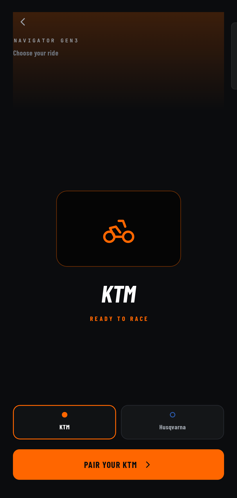
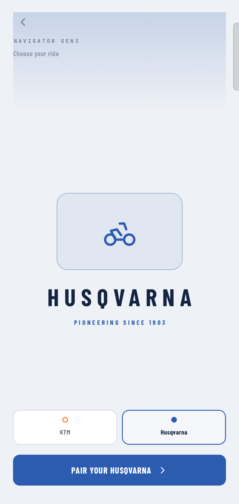
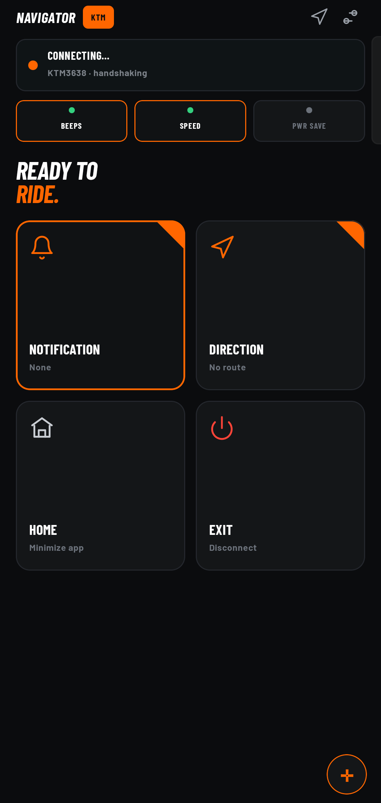
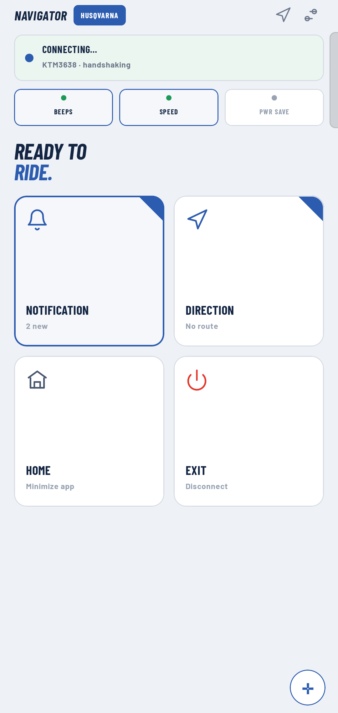
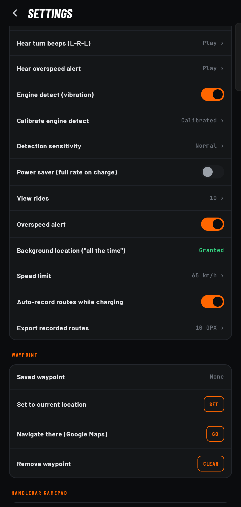
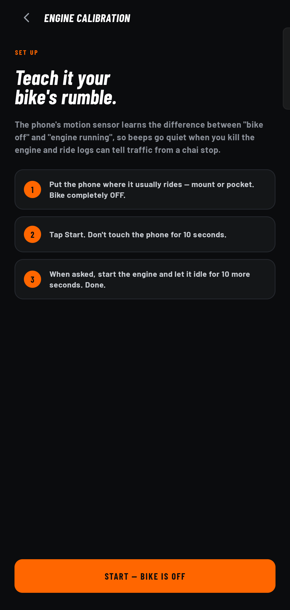

<p align="center">
  
</p>

<h1 align="center">Navigator Gen3</h1>

<p align="center">
  <b>Turn-by-turn navigation and notifications on your KTM and Husqvarna Gen-3 dashboard - free, private, and on-device.</b>
</p>

<p align="center">
  <sub>(formerly "OpenDash" - renamed to avoid a clash with existing projects; thanks to u/SubtleAsFucc for flagging it)</sub>
</p>

<p align="center">
  <i>An independent, open-source companion app. Not affiliated with, or endorsed by, KTM or Husqvarna.</i>
</p>

<p align="center">
  <a href="../../releases/latest"><b>Download the latest APK</b></a>
</p>

---

## What works today

**Google Maps turn-by-turn, on your bike's dash.** Start navigating in Google Maps and Navigator Gen3
mirrors it to the Gen-3 center display - the turn arrow, distance, road name, ETA and remaining
distance. The maneuver arrow (including roundabout exits, U-turns, keep/fork, ramps) is recognised
by a small on-device neural network trained on Google Maps' own icons, so it works even though Maps
puts no maneuver text in its notification.

**Now supports Husqvarna too.** The first release was KTM only. Navigator Gen3 now also works with
Husqvarna Gen-3 models - they share the same dash electronics - and the app themes itself to match
your bike (KTM in dark orange, Husqvarna in a lighter blue). You pick your brand on first run and
can switch any time from Settings.

**Turn sounds.** Optional stereo approach beeps - left ear for a left turn, right ear for a right
turn - that speed up as you near the corner, so you can feel a turn coming without looking down. They
go quiet automatically when you are stopped and come back when you move off. Volume is adjustable.

**Overspeed alert.** An optional speed-limit alarm that plays on the alarm audio channel at full
volume, so you can actually hear it over wind and engine noise.

**Ride recording and viewer (GPX).** The app can record your ride to a standard GPX track and show it
back as a map coloured by speed, with a speed-over-time graph, ride stats, and a rough traffic
readout (it tells time stuck in traffic from an intentional stop using whether the engine was
running). You can open .gpx files from other apps and share your recorded rides.

**Notification mirroring** to the dash, with group chats and summary notifications filtered out so
only real messages get through.

**Handlebar remote** as a media controller, an app gamepad (use the bike's Up/Down/Set/Back to drive
your phone's apps via Android accessibility, plus an on-screen D-pad), or the app's own menu -
switched with a triple-press of Up.

**Symbol testing and turn-icon calibration** screens to match icons to your exact dash, plus a
friendly greeting on connect and call answer/reject from the handlebar.

## Compatibility and setup notes

- Tested on a KTM 390 Adventure (2025). It targets the Gen-3 "connected" dash (the unit KTM's and
  Husqvarna's own apps use for turn-by-turn), so it should work on other 2020+ Gen-3 bikes, but
  1290 / 890 / SMC and the Husqvarna models are still lightly tested. Reports and logs are welcome.
- You likely need the connectivity / Tech Pack active. The turn-by-turn dash feature appears to be
  gated by the paid connectivity activation; if that is not active, the dash may not expose the nav
  feature to pair with. Not fully confirmed - testers with and without it, please report.
- Pairing tips if the bike does not show up: put the dash into "add device" mode from its own
  connectivity menu first, make sure Bluetooth is on, and note the app also lists devices already
  bonded to your phone. First pairing needs the physical "add device" confirm on the dash.
- Android 16 note (thanks u/ymopuri): sideloaded apps have notification access blocked until you
  enable "Allow restricted settings" (App info, three-dot menu) before granting notification access.

## Known issues

1. **Bluetooth auto-connect is not working reliably yet.** After you cycle the ignition off and on,
   the app does not silently reconnect on its own. When it does reconnect you currently have to
   accept the connection on the bike's dash each time. This is the top thing being worked on. The
   reconnect logic was reworked for this release (it waits for the dash to finish waking, then backs
   off instead of hammering the link), which reduces the repeated prompts, but it is not solved.
   Help from anyone with Android or BLE experience is very welcome.
2. First pairing still needs the physical "add device" confirmation on the dash. This is expected and
   only happens once per bike.
3. Turn-icon accuracy depends on your Google Maps version and your specific dash. If an icon looks
   wrong, use the Symbol Test and Turn-icon Calibration screens to correct it.
4. Husqvarna support has not yet been verified on a physical Husqvarna. It runs on the same dash
   protocol KTM uses and should work, but testing so far has only been on a KTM. Reports welcome.
5. Engine detection (used for the beep ducking and the traffic readout) relies on the phone's motion
   sensor, needs a short calibration, and varies by phone and mount.
6. This is a beta. If something crashes or misbehaves, please open an issue or share your logs from
   Settings, and include your bike model and firmware if you can.

## Privacy - nothing is collected, nothing leaves your phone

- No accounts. No analytics. No servers. No data collection. No ads.
- Everything runs on-device - the turn-icon AI, notification handling, ride recording, all of it.
- Your location, routes and notifications never leave the phone.
- Optional: if you add your own Gemini API key for notification summaries, only that text is sent to
  Google's API. This is off by default and entirely your choice.

## Screenshots

Pick your brand on first run and the whole app re-themes - KTM (dark) or Husqvarna (light):

| Brand select (KTM) | Brand select (Husqvarna) |
|---|---|
|  |  |

| Home (KTM) | Home (Husqvarna) |
|---|---|
|  |  |

| Ride tools and sounds | Engine-vibration calibration |
|---|---|
|  |  |

More from earlier builds: [dash mirror preview](docs/screenshots/mirror.png),
[turn-icon calibration](docs/screenshots/turn-calibration.png),
[symbol testing](docs/screenshots/symbol-testing.png),
[handlebar gamepad](docs/screenshots/handlebar-gamepad.png).

## Install (no build needed)

Grab the APK from the [latest release](../../releases/latest), copy it to your phone, and open it
(you will need to allow "install from unknown sources"). First-ever pairing needs the physical
"add device" confirmation on the bike's dash.

## Build it yourself

Prerequisites: Android Studio (latest) or the command-line Android SDK; JDK 17 (bundled with Android
Studio); Android SDK Platform 34 and build-tools.

```bash
git clone https://github.com/Pavanayi1/KTM-Nav-GEN3.git
cd KTM-Nav-GEN3

# point Gradle at your SDK (either export this or create local.properties)
echo "sdk.dir=$HOME/Library/Android/sdk" > local.properties   # macOS
# echo "sdk.dir=$HOME/Android/Sdk"        > local.properties   # Linux

./gradlew :app:assembleDebug
# -> app/build/outputs/apk/debug/app-debug.apk
```

Install to a connected phone with `adb install -r app/build/outputs/apk/debug/app-debug.apk`.

On the phone: enable Notification access (required to mirror navigation and notifications); enable
Accessibility for the handlebar gamepad only if you want the remote to control other apps; and
disable battery optimization for the app so it stays connected in the background.

## The turn-icon model (`ml/`)

The classifier is trained from scratch on Google Maps' own publicly shipped, self-labeled maneuver
icons - no proprietary weights. `ml/train_maneuver_model.py` reproduces the model
(`app/src/main/res/raw/maneuver_model.tflite`) locally or on free Google Colab. The labeled dataset
is generated on-device by a debug exporter (see [`ml/README.md`](ml/README.md)).

## Contributing - help wanted

This is an early, community-driven project and contributions are very welcome, whether you ride one
of these bikes or just like reverse-engineering and Android/BLE work. Good places to start:

- Fix the flaky Bluetooth auto-reconnect (the top known issue).
- Test on a physical Husqvarna and report how it goes.
- More nav apps (Waze, OsmAnd, HERE) and notification sources.
- Improve the turn-icon model with real captured icons.
- Testing on different Gen-3 bikes and firmware and reporting what works.
- UI polish, docs, translations.

Open an [issue](../../issues) with logs and details, or send a pull request. Please keep the
project's core promise intact: on-device only, no data collection.

## Disclaimer

Unofficial hobby project for Gen-3 KTM and Husqvarna dashes, provided as-is with no warranty. Not
affiliated with KTM or Husqvarna. Ride responsibly - do not interact with your phone while riding.

## License

[MIT](LICENSE)
