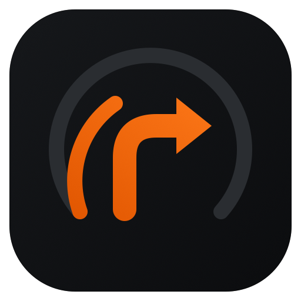
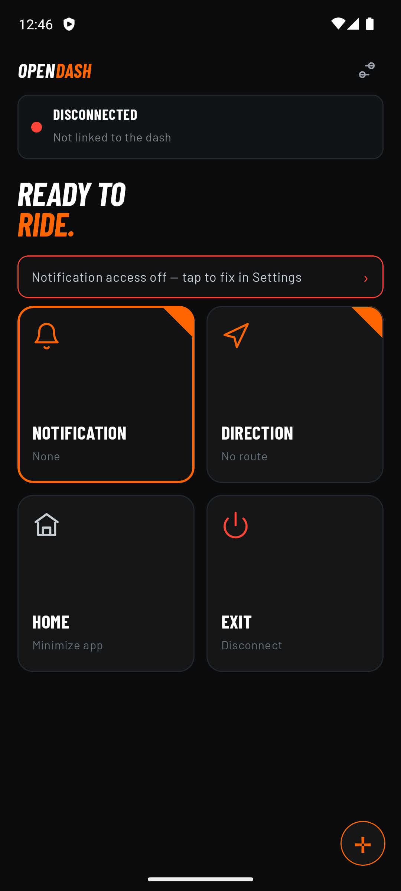
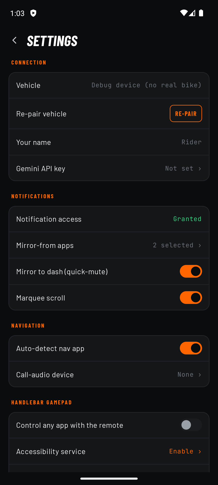
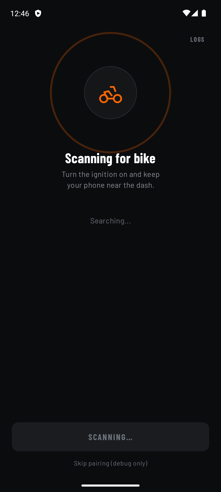
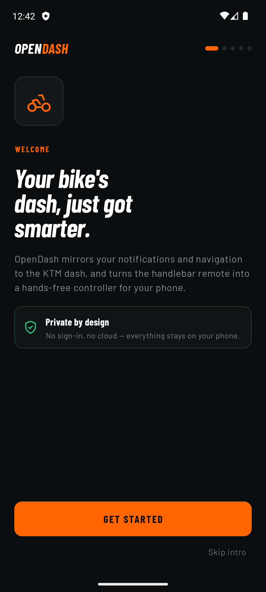
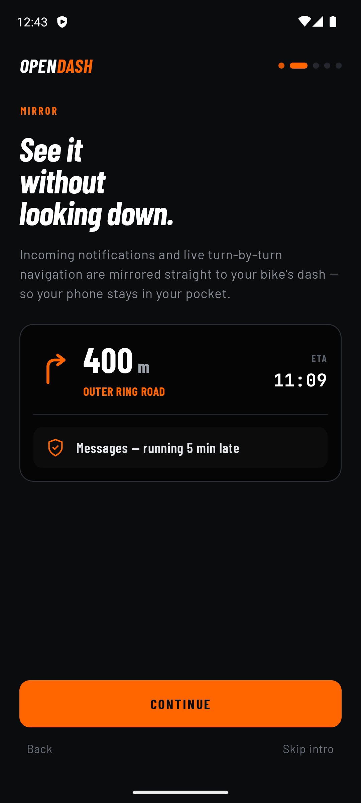
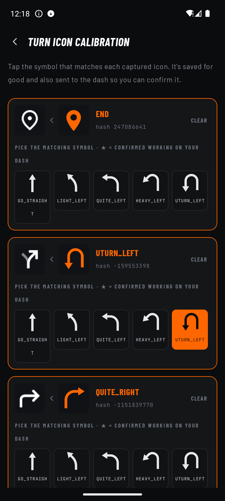
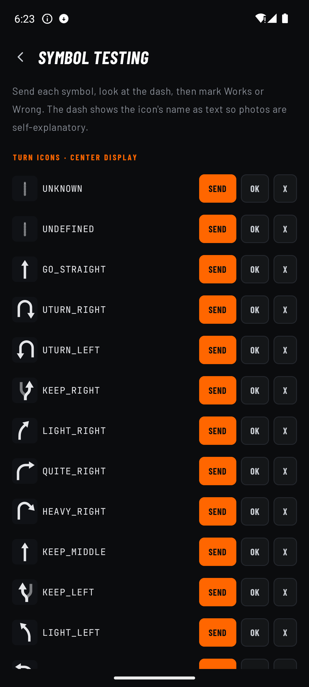
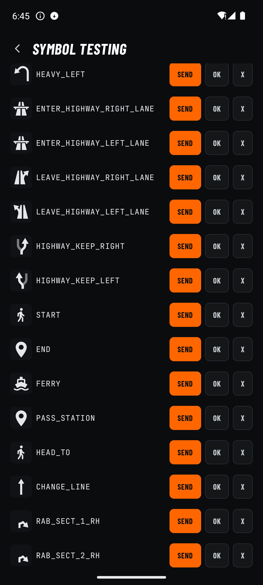
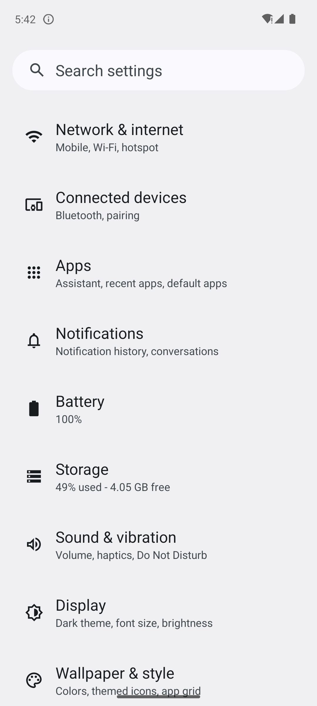

<p align="center">
  
</p>

<h1 align="center">OpenDash</h1>

<p align="center">
  <b>Turn-by-turn navigation and notifications on your KTM Gen-3 dashboard — free, private, and on-device.</b>
</p>

<p align="center">
  <i>An independent, open-source companion app. Not affiliated with, or endorsed by, KTM.</i>
</p>

<p align="center">
  <a href="../../releases/latest"><b>⬇️ Download the latest APK</b></a>
</p>

---

## ✅ What works today

**Google Maps turn-by-turn, on your bike's dash.** Start navigating in Google Maps and OpenDash
mirrors it to the Gen-3 center display — the turn arrow, distance, road name, ETA and remaining
distance. The maneuver arrow (including roundabout exits, U-turns, keep/fork, ramps) is
recognised by a small **on-device neural network** trained on Google Maps' own icons, so it
works even though Maps puts no maneuver text in its notification.

## 🔜 Coming soon

- **WhatsApp & other app notifications** on the dash
- More nav apps, richer telemetry, and more

## ⚠️ Known issues

- **Auto-reconnect is buggy.** Reconnecting to the dash after the ignition cycles off/on is not
  reliable yet — you may need to re-open the app or re-pair. Actively being worked on;
  **help wanted** (see Contributing).

## 🔒 Privacy — nothing is collected, nothing leaves your phone

- **No accounts. No analytics. No servers. No data collection. No ads.**
- Everything runs **on-device** — the turn-icon AI, notification handling, all of it.
- Nothing is uploaded anywhere. Your location, routes and notifications never leave the phone.
- *Optional:* if you add your **own** Gemini API key for notification summaries, only that text
  is sent to Google's API — this is off by default and entirely your choice.

## 📸 Screenshots

| App home | Settings | Pairing / search |
|---|---|---|
|  |  |  |

| Onboarding | Dash mirror preview | Turn-icon calibration |
|---|---|---|
|  |  |  |

| Symbol testing | Roundabout icons | Handlebar gamepad |
|---|---|---|
|  |  |  |

## ✨ Features

- 🧭 **Google Maps → dash** turn-by-turn (arrow + distance + road + ETA + remaining)
- 🤖 **On-device maneuver recognition** — a TensorFlow Lite model, no cloud, no proprietary blobs
- 🎮 **Handlebar remote as a gamepad** — use the bike's Up/Down/Set/Back buttons to navigate your
  phone's apps (via Android accessibility), plus an on-screen D-pad
- 🛠️ **Symbol testing & turn-icon calibration** screens to match icons to your exact dash
- 👋 A friendly **"Hi &lt;name&gt;!"** greeting on connect
- 📞 Call answer/reject from the handlebar, media control, and more

## 🚀 Install (no build needed)

Grab the APK from the [**latest release**](../../releases/latest),
copy it to your phone, and open it (you'll need to allow "install from unknown sources").
First-ever pairing needs the physical **"add device"** confirmation on the bike's dash (a KTM
security requirement).

## 🔨 Build it yourself

**Prerequisites**
- [Android Studio](https://developer.android.com/studio) (latest) — or just the command-line
  Android SDK
- JDK 17 (bundled with Android Studio)
- Android SDK Platform **34** and build-tools (Android Studio installs these on first open)

**Option A — Android Studio**
1. `git clone https://github.com/YOUR-USERNAME/opendash.git`
2. **File → Open** the `opendash` folder; let Gradle sync.
3. Pick the `app` run configuration and press **Run**, or **Build → Build APK(s)**.

**Option B — command line**
```bash
git clone https://github.com/YOUR-USERNAME/opendash.git
cd opendash

# point Gradle at your SDK (either export this or create local.properties)
echo "sdk.dir=$HOME/Library/Android/sdk" > local.properties   # macOS
# echo "sdk.dir=$HOME/Android/Sdk"        > local.properties   # Linux

./gradlew :app:assembleDebug
# → app/build/outputs/apk/debug/app-debug.apk
```
Install to a connected phone with `adb install -r app/build/outputs/apk/debug/app-debug.apk`.

**Enabling everything on the phone**
- **Notification access** (Settings → Notifications → Device & app notifications) — required to
  mirror navigation/notifications.
- **Accessibility → OpenDash handlebar gamepad** — only if you want the handlebar to control
  other phone apps.
- Disable battery optimization for OpenDash so it stays connected in the background.

## 🧠 The turn-icon model (`ml/`)

The classifier is trained **from scratch** on Google Maps' own publicly-shipped, self-labeled
maneuver icons — no proprietary weights. `ml/train_maneuver_model.py` reproduces the model
(`app/src/main/res/raw/maneuver_model.tflite`) locally or on free Google Colab. The labeled
dataset is generated on-device by a debug exporter (see [`ml/README.md`](ml/README.md)).

## 🤝 Contributing — help wanted!

This is an early, community-driven project and **contributions are very welcome** — whether
you ride a KTM or just like reverse-engineering and Android/BLE work. Great places to jump in:

- 🔧 **Fix the flaky auto-reconnect** (the top known issue)
- 📱 **More nav apps** (Waze, OsmAnd, HERE) and **notification sources** (WhatsApp, Telegram…)
- 🧠 **Improve the turn-icon model** with real captured icons
- 🌍 Testing on **different Gen-3 bikes / firmware** and reporting what works
- 🎨 UI polish, docs, translations

Open an [issue](../../issues) with logs/details, or send a pull
request. Please keep the project's core promise intact: **on-device only, no data collection.**

## ⚠️ Disclaimer

Unofficial hobby project for Gen-3 KTM dashes, provided as-is with no warranty. Not affiliated
with KTM. Ride responsibly — don't interact with your phone while riding.

## 📄 License

[MIT](LICENSE)
